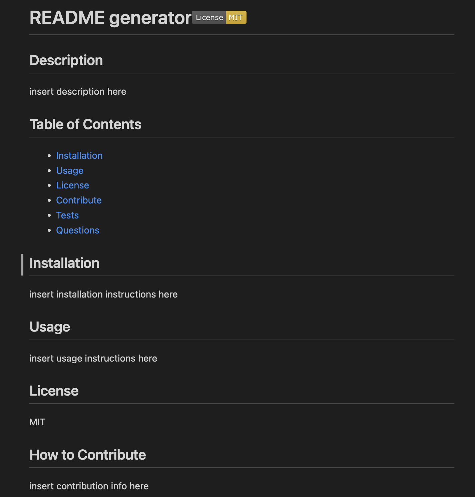
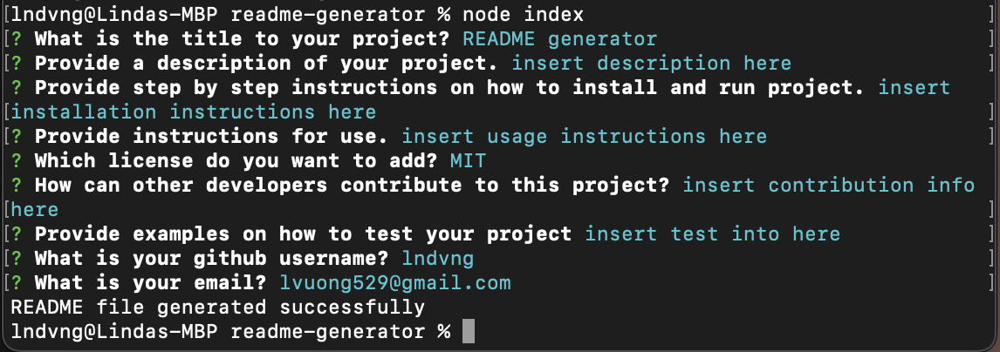
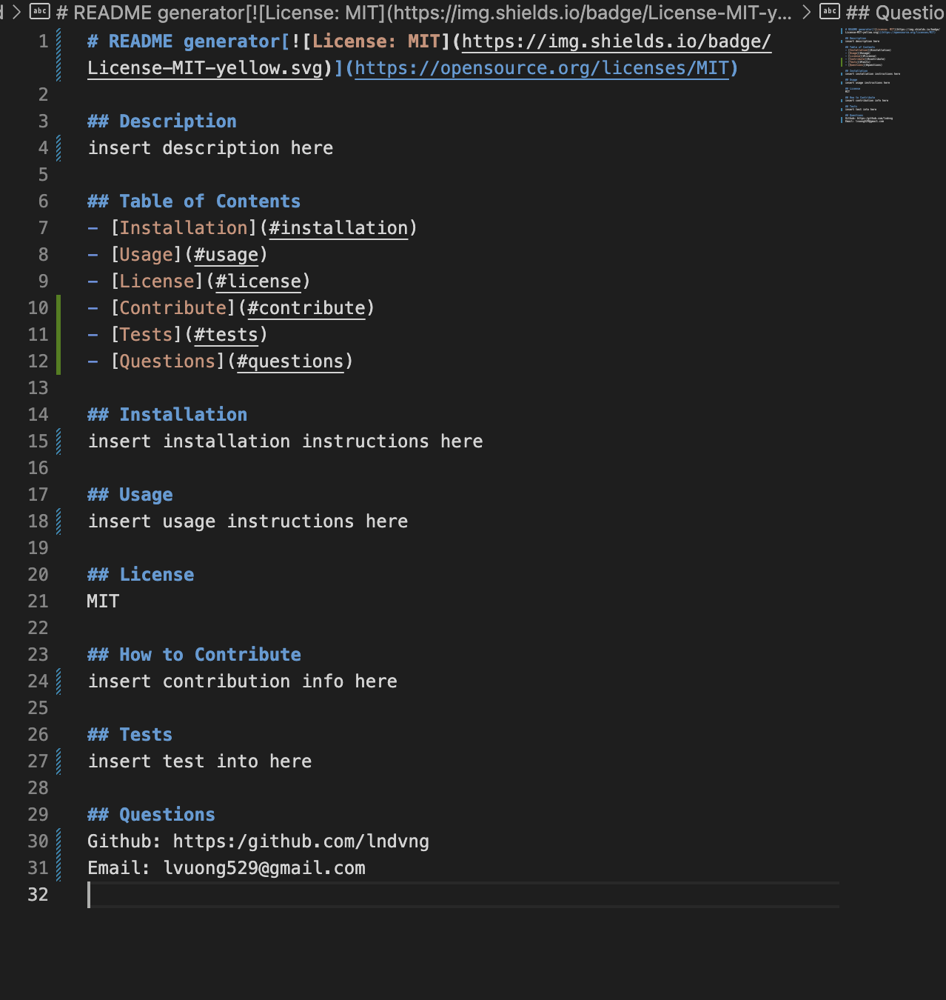

# README Generator
  
## Description
The motive behind this project was to create a README generator. It will save the developer a ton of time creating their own README. I learned how to create a function that generates markdown for README, a function to write the README file, and a function to initialize the app.
 
## Installation
1. Clone from repo.
2. Open folder with visual studio code or any text editor of choice.
3. Run ‘node index ‘in terminal to run code.

## Usage
1. Open repo in terminal.
2. Run ‘node index’ to start application
3. Answer prompts accordingly

4. README will be generated after all prompts are answered

## Video Demo Link
[Click here for Demo Video](https://drive.google.com/file/d/1hyWfrn_Y4eAjSzA47iLwxwq-Y1Zanm7z/view?usp=sharing)